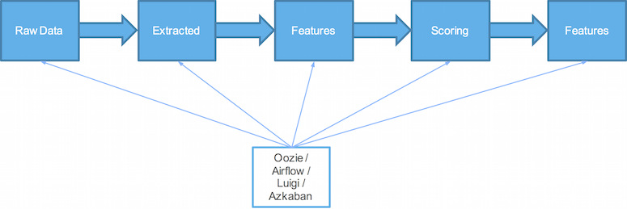

# Roadmap

A framework for feature engineering using Spark that applies the following principles:

* Reactive data pipelines - data from source is "pulled through" a set of transformations to derive a feature, which may involve a machine learning model step (similar to how a spreadsheet recalculates after a cell change). Pipelines are defined through function decomposition instead of through orchestration. When new data becomes available, a message is published, which results in all features that are dependent on the new data to recalculate.
* Feature history is stored as nested data structures, which is supported by storage formats such as Parquet and Cassandra.

Traditionally data is “pushed through” given an updated source and coordinated using a workflow / scheduling tool.

A reactive system will publish a message that new data is available, and the reactive system will ”pull data through” to update features just-in-time. This creates a lean yet low latency data pipeline.

Using a nested structure, history belongs to the individual feature. History doesn’t need to be recalculated at all if not required for the new feature.

# Ingestion

## Ingestion Philosophy

* Decouple raw ingestion from consumable data
** Move heavy lifting into Spark
** Keep raw data delivery service lean
** Case Study: Uber
