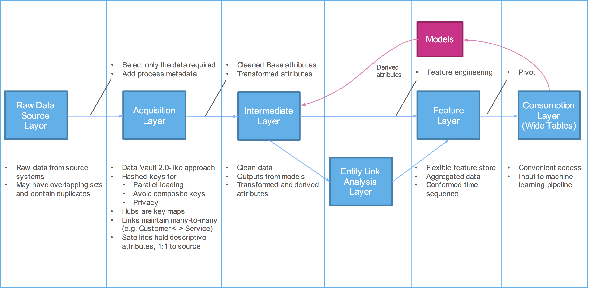

# Table of Contents

* [Usage](usage.md)
* [Configuration](configuration.md)

# Loading data

The Diamond Framework starts with the expectation that data is first available in HDFS, either as a Hive table or a Parquet file. The first step will be to load a dataset into a DataFrame. The benefit of using Spark DataFrames as the common data structure is that the schema travels with the data. Therefore, we can use reflection to accomplish tasks instead of hard-coded values that must be updated every time the schema changes. For example, we can write
 
    val fields = df.schema.fieldNames.toList
    df.select(fieldNames.map(col): _*)

instead of

    df.select("age25to29", "age30to34", "age35to39", "age40to44", "age45to49", "age50to59", "age60Plus", "cust_id", "incomeB", ...)

The DataFrames API is also a powerful data manipulation tool, with built in parallel processing capabilities to handle large volumes of data.

The high-level data processing flow will look like:

    Raw Data (Raw Data Source Layer)
        --> Loaded Data (Acquisition Layer)
            --> Tidy Data (Intermediate Layer)
                --> Resolved Entities (Entity Link Analysis Layer)
                    --> Extracted Features (Feature Layer)
                        --> Wide Tables (Consumption Layer)

                        

<table>
    <tr>
        <th>Data Layer
        <th>Description
    </tr>
    <tr>
        <td>Raw Data Source Layer
        <td>Raw source files
    </tr>
    <tr>
        <td>Acquisition Layer
        <td>
            
Ensures nonduplicated traceable data.
            <ul>
                <li>Selects only the data needed.
                <li>Hashes entity keys.
                <li>Adds metadata to trace lineage.
                <li>Separates structural information from descriptive attributes.
            </ul>
        </td>
    </tr>
    <tr>
        <td>Intermediate Layer
        <td>Provides <a href="http://vita.had.co.nz/papers/tidy-data.pdf">tidy datasets</a>. Separates data cleansing transforms from feature extraction routines.
    </tr>
    <tr>
        <td>Entity Link Analysis Layer
        <td>For example, links customer records through chains of customer key maps.
    </tr>
    <tr>
        <td>Feature Layer
        <td>A flexible data store of facts and events, usually aggregated or binned.
    </tr>
    <tr>
        <td>Consumption Layer
        <td>"Wide table" views of features. Multiple views are supported. For example, a Snapshot view shows the latest attribute values at a point in time. A Chord view shows the attribute values at the point in time of a given event.
    </tr>
</table>

## Acquisition Layer

Acquisition Layer data structures will adopt Data Vault 2.0 conventions. A Data Vault model is designed to provide long-term historical storage of data coming in from multiple operating systems. It is also a method of looking at historical data that, apart from the modeling aspect, deals with issues such as auditing, tracing of data, loading speed and resilience to change.

Data vault modeling focuses on several things. First, it emphasizes the need to trace of where all the data came from. This means that every row in a data vault must be accompanied by record source and load date attributes, enabling an auditor to trace values back to the source.

Second, it makes no distinction between good and bad data ("bad" meaning not conforming to business rules). This is summarized in the statement that a data vault stores "a single version of the facts" (also expressed by Dan Linstedt as "all the data, all of the time") as opposed to the practice in other data warehouse methods of storing "a single version of the truth" where data that does not conform to the definitions is removed or "cleansed".

Third, the modeling method is designed to be resilient to change in the business environment where the data being stored is coming from, by explicitly separating structural information from descriptive attributes.

Finally, data vault is designed to enable parallel loading as much as possible, so that very large implementations can scale out without the need for major redesign.

Data vault modeling defines four table types.

### Hubs

Hubs contain a list of unique business keys cross referenced to a hashed representation of the key.

### Links

Associations or transactions between business keys (relating for instance the hubs for customer and product with each other through the purchase transaction) are modeled using link tables. These tables are basically many-to-many join tables, with some metadata.

### Satellites

The hubs and links form the structure of the model, but have no temporal attributes and hold no descriptive attributes. These are stored in separate tables called satellites.

Usually the attributes are grouped in satellites by source system. However, descriptive attributes such as size, cost, speed, amount or color can change at different rates, so you can also split these attributes up in different satellites based on their rate of change.

All the tables contain metadata, minimally describing at least the source system and the date on which this entry became valid, giving a complete historical view of the data.

### Reference tables

They are there to prevent redundant storage of simple reference data that is referenced a lot.

See [usage instructions](usage.md).

## Intermediate Layer

The rationale for the Intermediate Layer (IL) is twofold.

1. Selected data is cleaned and prepared into tidy datasets to simplify feature extraction. (It also means feature extraction code is not commingled with data cleaning code, leading to good modular code design.)
2. As joins can be a cause of performance issues in large scale feature extraction, these joins are performed up front.
